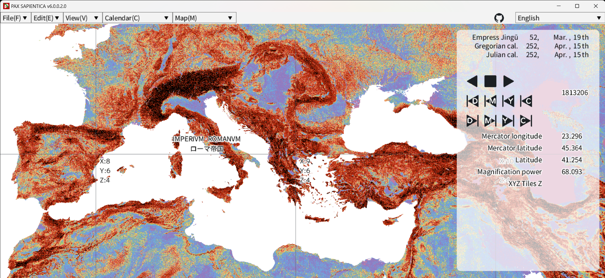

 

# Overview

This software is PAX SAPIENTICA (abbreviated PAXS).
PAXS is a GIS for philological, archaeological, and anthropological data.
It has the ability to display calendars for each region in each time period and agent-based simulation.

# How to Install

This software uses OpenSiv3D (v0.6.10).

To try this library, build cmake.

# Code Documentation

https://aspjt.github.io/PAX_SAPIENTICA/

# List of elements supported by this software.

## Calendar

|Available|Calendar Name|
|:---:|:---|
|✅|Julian calendar|
|✅|Gregorian calendar|
|✅|Japanese calendar|
|✅|Islamic calendar|
|✅|Julian day number|

## Agent-Based Simulation

This is an agent-based simulation that estimates settlement and population dynamics in the Japanese archipelago from the 3rd to 7th centuries.
It was presented at the 48th Annual Meeting of the Japan Association for Archaeoinformatics on December 2, 2023.

## Mitochondrial DNA

This software can handle DNA haplogroup data of ancient human bones.

The following GIF animation shows the changes in East Asian mtDNA haplogroups from 1 Julian day (4713 BC) to the present.

## Movement of a person

This software allows you to visualize and move historical figures.

---

# Supported Environment

* CMake (e.g. Visual Studio Code)
* .sln / Microsoft Visual Studio
* Android Studio

### Android Studio

This library has been tested to work in a mobile environment.

# Screenshot

|||
|:---:|:---:|

---

# Main Developers

|Icon|Name|Main Work|
|:---|:---|:---|
||As Project|● Planning ● Design Concepts ● Specification Document Preparation|
||guinpen98|● Programming ● Simulation ● GitHub Actions / CI&CD|

---

# License

These codes in the Library directory are licensed under **CC0 (PUBLIC DOMAIN)**.

Third party content is copyrighted by its respective owners.

