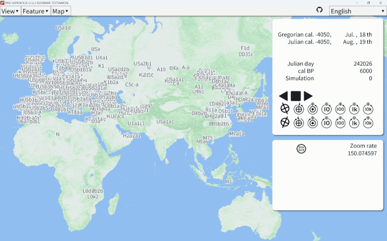

# PAX SAPIENTICA  

# Overview

This software is PAX SAPIENTICA (abbreviated PAXS).
PAXS is a GIS for philological, archaeological, and anthropological data.
It has the ability to display calendars for each region in each time period and agent-based simulation.

# List of elements supported by this software.

## 📅 Calendar

|Available|Calendar Name|
|:---:|:---|
|✅|Julian calendar|
|✅|Gregorian calendar|
|✅|Japanese calendar|
|✅|Chinese calendar|
|✅|Islamic calendar|
|✅|Julian day number|

## 🏠 Agent-Based Simulation (ABS)

This is an agent-based simulation that estimates settlement and population dynamics in the Japanese archipelago from the 3rd to 7th centuries.
It was presented at the 48th Annual Meeting of the Japan Association for Archaeoinformatics on December 2, 2023.

Figure. Percentage of mitochondrial DNA haplogroups in the Owari Province of Japan by year from 950 BCE to 100 BCE as output by ABS.

## [🧬 DNA Haplogroups](Data/Genomes/HomoSapiens)

This software can handle DNA haplogroup data of ancient human bones.

The following GIF animation shows the changes in East Asian mtDNA haplogroups from 1 Julian day (4713 BC) to the present.

Ancient human bone mtDNA data registered as of December 21, 2023.

## 👤 Movement of a person

This software allows you to visualize and move historical figures.

## 📍 Distributions

### Distribution of bronze swords in NortheastAsia

### Distribution of Zenpokoenfun tombs in Japan

### Distribution of Yayoi Funkyubo tombs in Japan

### Distribution of bronze bells in Japan

### Distribution of weapon-shaped bronzes in Japan

---

# How to Install

This software has both a GUI and a CUI.

### GUI

The GUI supports the following libraries

* SFML (CMake)
* [SFML v2.6.1 (.sln / for Windows)](Projects/MapViewer/Windows/SFML_2.6.1) - Available without installation
* OpenSiv3D (tested with v0.6.13 & Visual Studio Community 2022 v17.8.3)
* DxLib (tested on Windows and Android versions)

Any of the above libraries will launch the GUI software.

### CUI

To try this library, build cmake.

> [!TIP]
> For example, clone this repository. You can open the cloned directory with VS Code and build it with CMake.

# Code Documentation

https://aspjt.github.io/PAX_SAPIENTICA/

# How to Contribute

This project welcomes issues and pull requests.
Anyone can send issues and pull requests.

You can find out how to contribute [here](CONTRIBUTING.md).

# Supported Environment

### Compilers

* GNU Compiler Collection (GCC)
* Clang
* Microsoft Visual C++ (MSVC)

### Language Version

C++17 or later

### Build Tools

* CMake (e.g. Visual Studio Code)
* .sln / Microsoft Visual Studio
* Android Studio

### Android Studio

This library has been tested to work in a mobile environment.

> [!IMPORTANT]
> The Android version of DxLib, a wrapper library for drawing APIs, is used.
> Drawing APIs such as OpenGL and Vulkan are not directly supported.

---

# Main Developers

|Icon|Name|Main Work|
|:---|:---|:---|
||As Project|● Planning ● Design Concepts ● Specification Document Preparation|
||guinpen98|● Programming ● Simulation ● GitHub Actions / CI&CD|

---

# License

These codes in the Library directory are licensed under **CC0 (PUBLIC DOMAIN)**.

Third party content is copyrighted by its respective owners.

